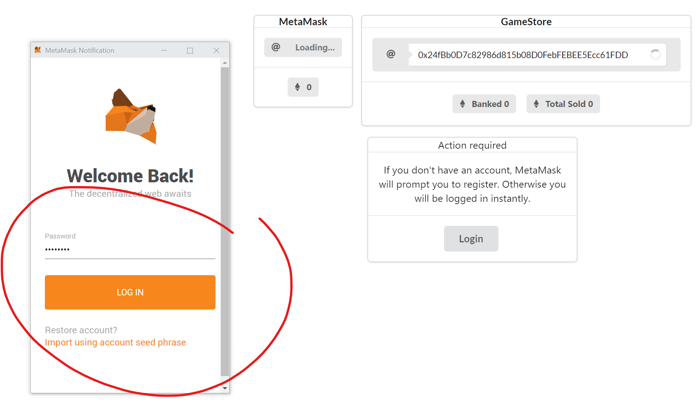
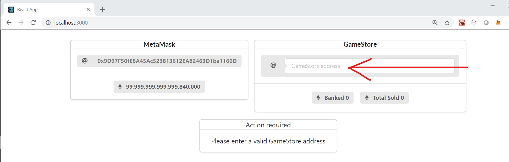
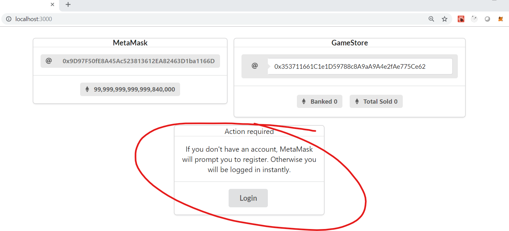
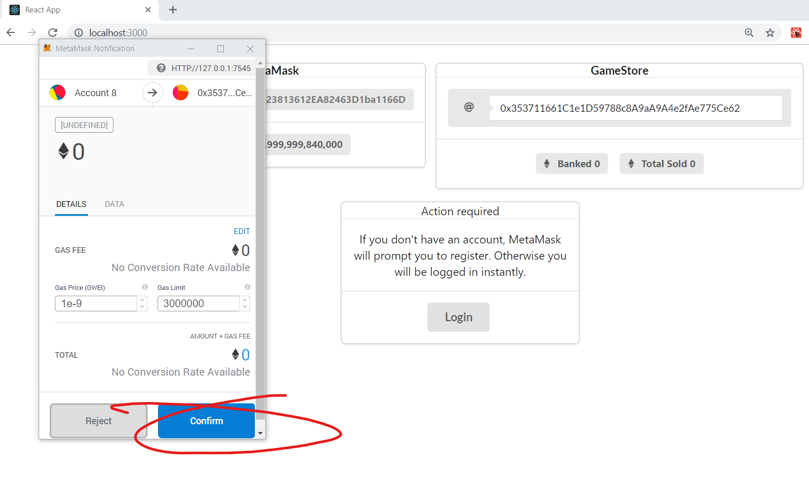
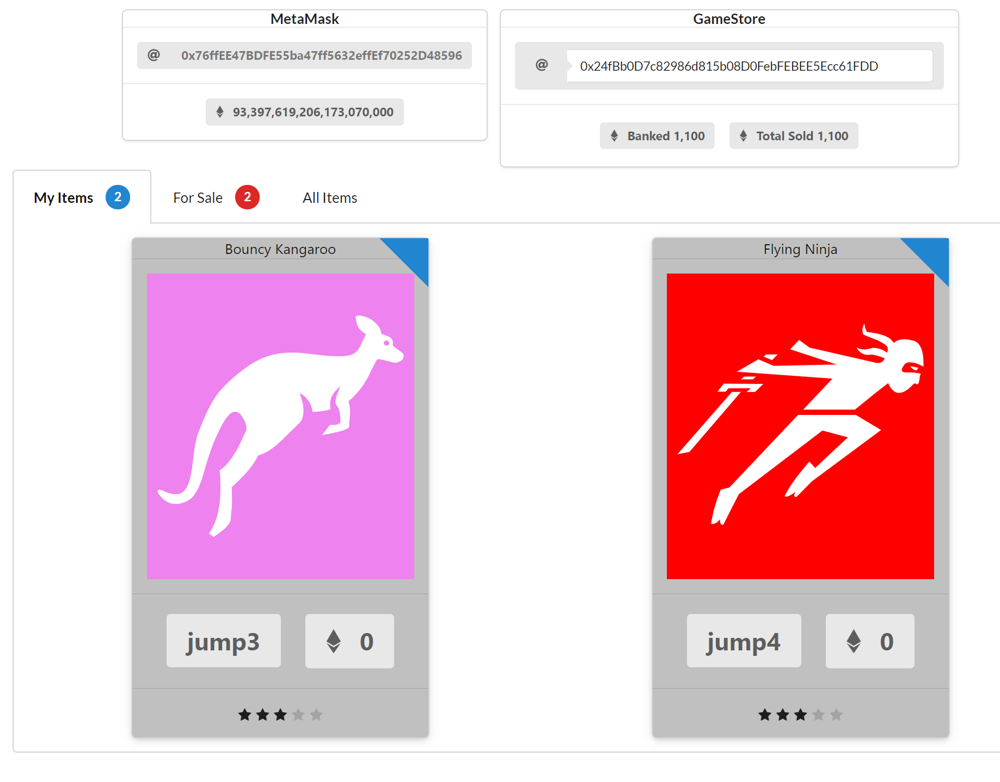
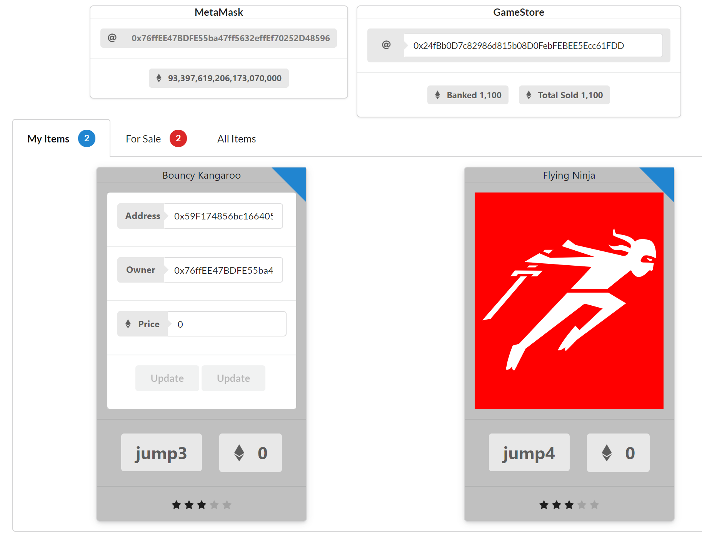
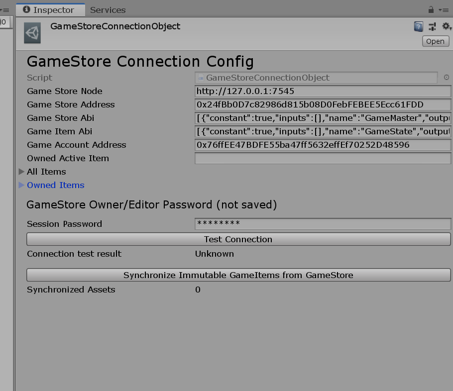
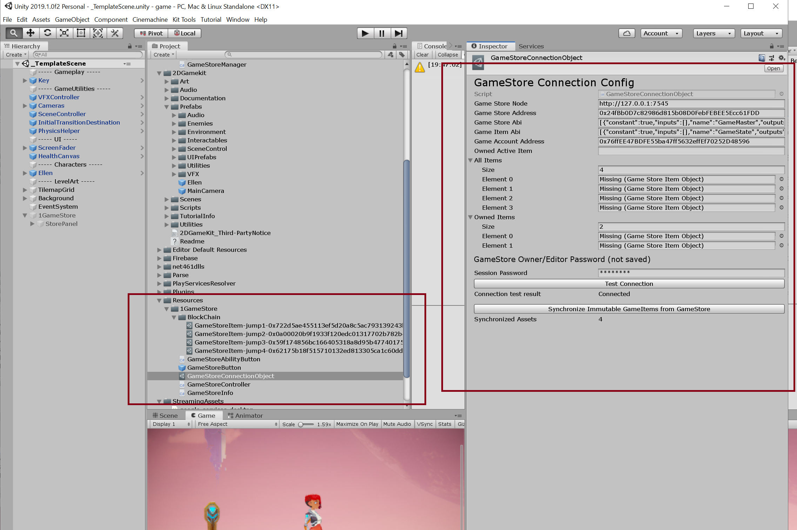
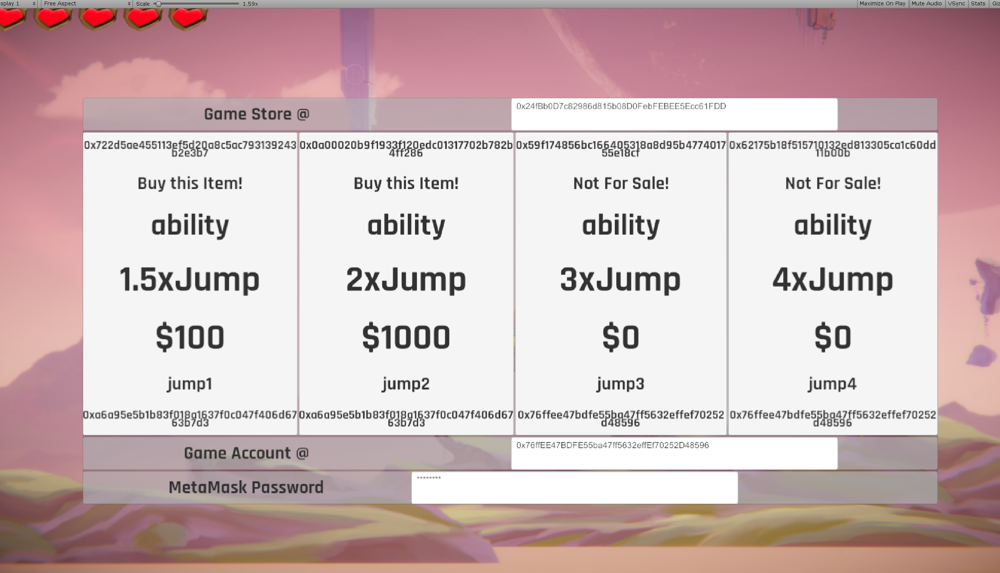

# GameStore

## Table of Contents

1. Background
2. SmartContracts
3. Setup
4. Deploy
5. Use the React GameStore App
6. Use the GameStore in Unity

---

## Background

This sample includes Ethereum SmartContracts, Unity assets and a React webapp

- the contracts provide a GameStore and GameItems

- the React App supports a browser store experience

- the unity App supports both a Design time component and Runtime features
  - the design time component creates Scriptable objects representing real items on the blockchain that you can place in the game
  - the runtime component is a Store where players can purchase and activate "abilities" related to the items

---

## SmartContracts

### GameItem

- GameItem can be created, priced, and sold (transfered) via the GameStore

- Essential Properties:

  1. Owner
  2. Price
  3. Game (address of the game/store that controls it)

- Sample Properties, etc - used to implement features in the game:

  1. ItemKey
  2. ItemType
  3. ItemData

  - (In this sample, ItemData is used as the modifiers of a jumping ability)

---

### GameStore

- The game is controlled by a GameOwner

  - only the GameOwner can create new items

- Tracks a "StoreAccount" struct for each player account

  - as items are sold, the player's store account collects the proceeds in the StoreAccount.Balance. The Player can call WithdrawBalance to retreive the funds

- Methods:

  - `TransferGameMaster`(address newGameMaster);
  - `CreateGameItem`(string calldata itemKey, string calldata, itemType, string calldata itemData) external;
  - `SetGameFactory`(IGameFactory factory)

  // info methods

  - `GetAllItems`()
  - `GetAllAccounts`()
  - `GetAccount`(address owner)

  // account methods

  - `RegisterAccount`(address owner)
  - `GetMyAccount`()
  - `PurchaseItem`(IGameItem gameItem)

  // account holders can withdraw funds for the items sold

  - `WithdrawBalance`()

---

## Setup Tools

1. Install Ganache

   - run,
   - goto settings,
   - note the RPC server details ip and port (127.0.0.1 and 7475)
   - note the Account Seed Phrase

2. MetaMask

   - install MetaMask extension in Chrome
   - Configure MetaMask to connect to local Ganache instance

     - Find Networks > select Custom RPC network
     - configure the RPC server details ip and port (127.0.0.1 @ 7454)
     - Login using the Account Seed Phrase from Ganache

3. Python v2.7.15 is REQUIRED. If you have a 3+ it will probably fail

   - (Windows) From Administrative Powershell: npm install --global --production windows-build-tools
   - (Non-Windows)... ?

4. VSCode
   - Install VSCode
   - Install the Azure Blockchain extension

---

## Deploy

### Deploy to Blockchain

- Run Ganache (or setup other blockchain in truffle-config.js)

- from root, open command prompt

- run "npm i"

- Run "truffle migrate --reset" from the root of the project

- contracts should be deployed:

  - 1 GameStore
  - 4 GameStoreItems

- copy the GameStore address

- go to browser and configure your local Ganache instance in MetaMask.

- Login as Account 1, and make sure you can switch to Account 2

### Deploy the React app

- open command prompt at the /app folder
- run "npm i"
- run "npm run start"
- browse to http://localhost:3000

---

## Use the React GameStore app

- open browser to the http://localhost:3000
- MetaMask will ask you to allow login / approve all activity
- Make SURE MetaMask is pointing at your local Ganache instance

- Update the GameStore Address with the GameStore contract you just deployed

- Check that the Account1 Address is shown in the MetaMask box and login

- Confirm the login with MetaMask

- Note that all the GameItems belong to Account 1 originally (belongs to the GameMaster).

- Items that are yours will appear under My Items
- Items you can buy appear under For Sale

- Make an item for sale by giving it a Price - Save the Price above 0 and approve via MetaMask

- Now switch accounts to Account 2 in metamask.

- Reload the site (possibly the browser)

- Now you should see some items in ForSale, and all the items in All items.

- Purchase an Item, and it should move to your item tab

- Switch accounts and login as Account 1, to see the purchases.

- Notice Account 1 now has an Amount stored in the GameStore Contract. Acccount 1 can request to transfer the collected funds.

---

### Use the GameStore in Unity

The unity project has both a Design time component and Runtime.

- Start from the 2D tutorial

https://www.youtube.com/watch?v=4cF7Sl7FazE

- Create a folder at:

  - Assets/Resources/1GameStore

- Copy the custom scripts from /unity and put them in the 1GameStore folder

- Create another folder:

  - Assets/Resources/1GameStore/BCItems

- From Assets menu choose Assets/Create/GameStore Connection

  - This will create a gamestore connection asset. Update it with the correct GameStore properties

- Test the connection.

- Synchronize the assets. This will create files for each item

- Add 1GameStore Panel to the scene and configure an item to open it.

- Purchase items during the game

---
